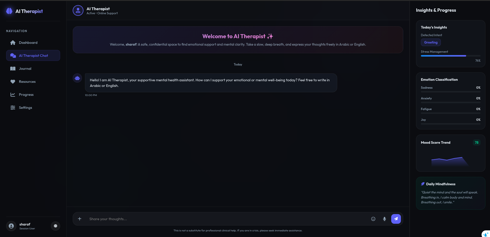
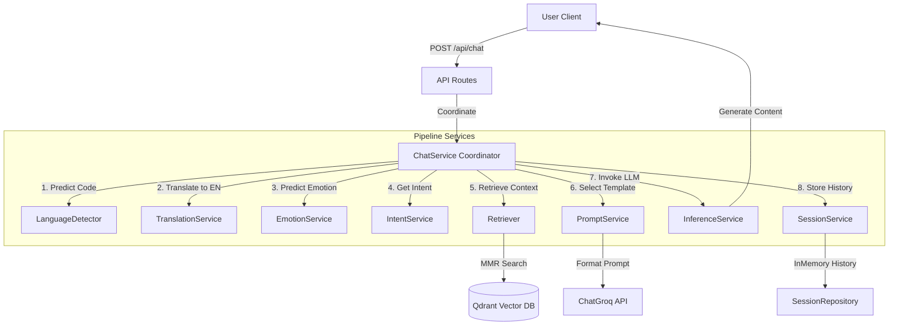

# AI Therapist - Mental Health Support Chatbot

An advanced, clean-architecture AI Therapist system built with **FastAPI**, **LangChain**, **Groq (LLM)**, **Hugging Face Models**, and **Qdrant Vector DB**. This system supports multilingual interactions (Arabic & English), analyzes user sentiment and emotion, classifies user intent, and retrieves context from a curated clinical database (RAG) to generate empathetic responses.

---

## 🎨 User Interface Design

Below is a modern dashboard UI mockup showcasing the chat session and dynamic Insights panel:



---

## ⚙️ Project Flow & Architecture

The system is designed with strict **Separation of Concerns (SoC)**, dividing responsibilities between independent services, a central coordinator, and data access layers.

### Dynamic Pipeline Flow

When a user sends a query, it travels through the following sequence:



---

## 📂 Project Structure

```text
project_root/
├── main.py                     # Root-level FastAPI startup & Static mounting
├── requirements.txt            # System dependencies
├── .env.example                # Template for environment configurations
├── .gitignore                  # Git rules to ignore models/pycache
├── static/                     # Frontend static client files (HTML, CSS, JS)
│   ├── images/
│   │   └── ai_therapist_interface.png
│   ├── index.html
│   ├── app.js
│   └── style.css
└── app/
    ├── api/
    │   └── routes/
    │       └── chat.py         # HTTP Endpoint validating & invoking ChatService
    ├── core/
    │   ├── config.py          # Environment settings loader
    │   ├── constants.py       # Static mappings & language lists
    │   └── logging.py         # Central logger config
    ├── schemas/
    │   ├── requests.py        # Pydantic request models
    │   └── responses.py       # Pydantic response models
    ├── services/
    │   ├── chat_service.py     # Pure Workflow Coordinator (Preloads all models)
    │   ├── prompt_service.py   # System Prompt generator & variable injector
    │   ├── inference_service.py# LLM caller (Groq API wrapper)
    │   ├── intent_service.py   # User Intent Classifier (Structured via Instructor)
    │   ├── emotion_service.py  # Local PyTorch sequence classification model
    │   ├── language_service.py # TF-IDF + LinearSVM pipeline
    │   ├── translation_service.py # Multilingual translations (Groq model)
    │   └── session_service.py  # User conversational session interface
    ├── repositories/
    │   ├── session_repository.py # InMemoryChatMessageHistory wrapper
    │   └── qdrant_repository.py  # Qdrant client connection registry
    ├── rag/
    │   ├── embeddings.py       # HuggingFace Embeddings offline weights loader
    │   ├── retriever.py        # MMR matching algorithm with score thresholding
    │   ├── chains.py
    │   └── prompts.py          # Prompt templates
    └── assets/                 # Cached local model weights & SVM binaries
        ├── models/
        └── embeddings/
```

---

## 🛠️ Installation & Setup

### 1. Clone the repository
```bash
git clone <repository-url>
cd AI_therapist
```

### 2. Configure Environment Variables
Create a `.env` file in the root directory based on `.env.example`:
```ini
GROQ_API_KEY=your_groq_api_key
GROQ_MODEL_NAME=llama3-70b-8192
QDRANT_API_KEY=your_qdrant_cloud_api_key
QDRANT_URL=your_qdrant_cloud_url
COLLECTION_NAME=mental-health-bot
HUGGINGFACE_HUB_MODEL=sentence-transformers/all-MiniLM-L6-v2
VECTOR_SIZE=384
CLEANED_DATA_PATH=app/assets/cleaned_mental_health_data.csv
HF_TOKEN=your_huggingface_write_token
```

### 3. Install Dependencies
Make sure you have Python 3.10+ and install requirements:
```bash
pip install -r requirements.txt
```

### 4. Run the Application
Run the root-level entrypoint using `uvicorn`:
```bash
uvicorn main:app --reload
```
All weights (language detection SVM, emotion classifier, sentence embeddings) will automatically preload on startup.
* The API docs will be available at: `http://127.0.0.1:8000/docs`
* The interactive web UI will be served at: `http://127.0.0.1:8000`

---

## 👥 The Team

* **Ahmed Aboalasaad** - Lead AI Software Architect & NLP Specialist
  * *Responsibilities*: Design and implementation of the clean architecture flow, intent detection models, and pipeline orchestration.

*(Feel free to list additional collaborators here!)*
